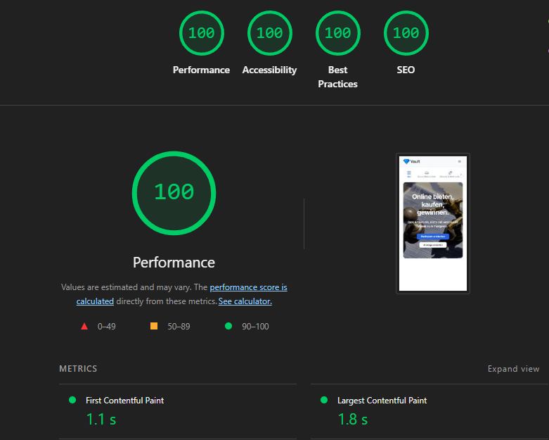
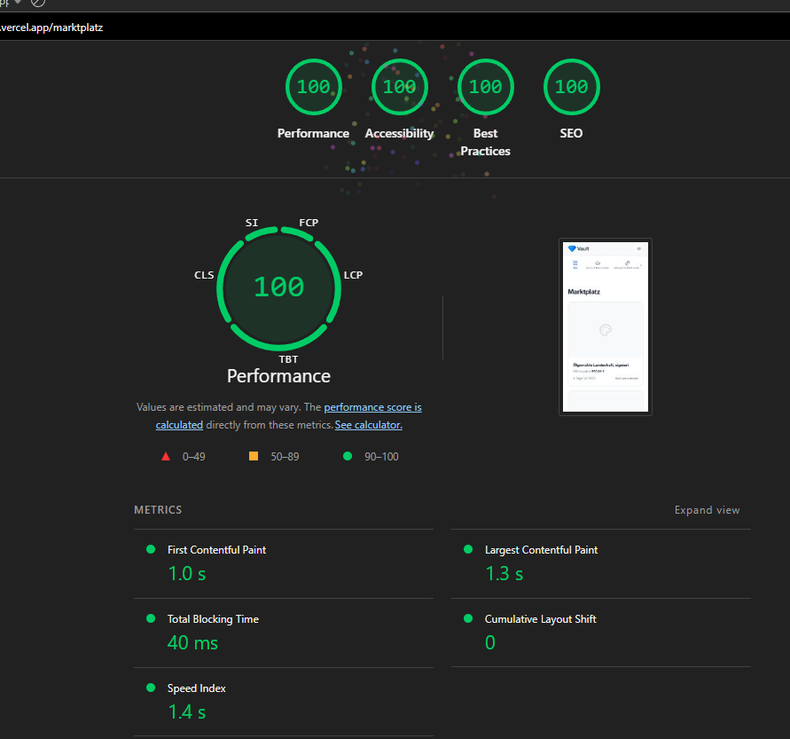
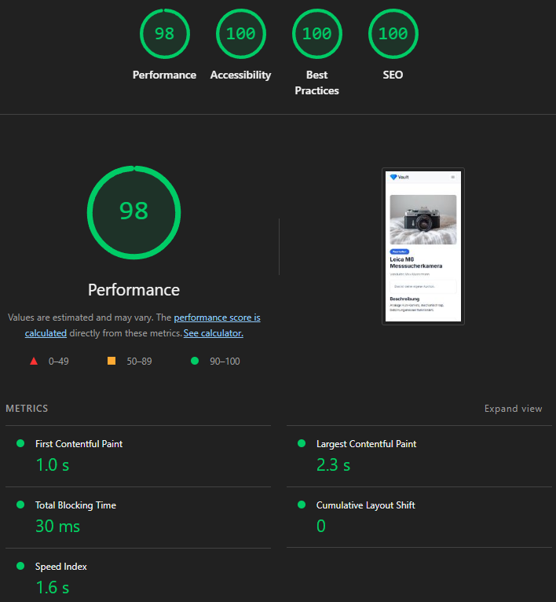

# Vault

Vault is an online marketplace for **auctions and instant "buy now" purchases** — list an item, let people bid until the timer runs out, or sell it immediately at a fixed price. It's a portfolio / learning project built to practice a realistic, payment-backed full-stack app end to end.

## Live demo

**https://vault-auctions-app.vercel.app**

- **Log in:** register with any email and password — email verification is not required to sign in.
- **Test a purchase:** use Stripe's test card `4242 4242 4242 4242` with any future expiry date and any CVC.

## Lighthouse

**Perfect 100 for Accessibility, Best Practices and SEO across all pages; Performance 98–100 (mobile).**

Performance per page: Home 99 · Marketplace 100 · Listing detail 98.

| Home | Marketplace | Listing detail |
| --- | --- | --- |
|  |  |  |

## Features

- **Three listing types** — pure auction (start price + runtime), pure fixed price, or both at once on the same listing.
- **Browse & find** — category bar, category filter, full-text search, and sorting (newest, ending soon, price), all combinable via URL params.
- **Bidding** with a live, per-second countdown to the auction's end.
- **Instant buy** via Stripe Checkout; the listing ends immediately and the buyer pays.
- **Pay-after-win** — the highest bidder at close gets a pending order and pays through the same Checkout flow.
- **Email notifications** for being outbid, winning, and payment received (plus email verification on sign-up).
- **Create & edit listings** with image upload, pricing, and category.
- **User dashboard** — your listings, your bids, and won/bought items with a pay button for unpaid wins.
- **Internationalization** — German (default) and English via `next-intl`.

## Tech stack

| Area | Technology |
| --- | --- |
| Framework | Next.js (App Router) + TypeScript |
| Styling | SCSS Modules |
| Internationalization | next-intl |
| Authentication | Better Auth (email / password) |
| Database | PostgreSQL (Supabase) + Drizzle ORM |
| File storage | AWS S3 (presigned-URL uploads) |
| Payments | Stripe (Checkout + webhooks) |
| Transactional email | Brevo |
| Scheduled jobs | AWS Lambda + EventBridge Scheduler |
| Tests | Vitest |
| Hosting | Vercel |

## Engineering decisions

These are the choices that drove the architecture — the *why* behind the code.

### Race-safe bidding

Two people can bid on the same auction at the exact same moment. Each bid runs inside a database transaction that locks the auction row (`SELECT … FOR UPDATE`), so the "is this bid higher than the current price?" check and the price update happen atomically — concurrent bids are serialized instead of overwriting each other. This is backed by an integration test that fires 2 and 5 simultaneous bids at a real Postgres instance and asserts that exactly one wins.

### Webhook as the source of truth

A payment is only marked paid from Stripe's signature-verified `checkout.session.completed` webhook, never from the browser redirect — otherwise a closed tab or a flaky network could lose a confirmed payment. The handler updates the order with an atomic `UPDATE … WHERE status = 'pending'`, which makes it idempotent: a duplicate webhook delivery changes nothing and sends no second email.

### Scheduled auction finalization

Auctions must end on time even if nobody has the page open. An EventBridge schedule invokes a Lambda every minute, which calls a secret-protected endpoint (`/api/cron/finalize`) that ends expired auctions, sets the winner, and creates the pending order. Finalization is centralized in one place so the "you won" email fires exactly once.

### Money as integer cents

All amounts are stored and calculated as integer cents, never floating-point euros, so rounding errors can't creep into prices or totals. Conversion and formatting live in one small, pure module and are covered by unit tests.

## Testing

Tested with [Vitest](https://vitest.dev/):

- **Money math** — euro↔cent conversion, rounding edges, and localized currency formatting (unit tests).
- **Webhook idempotency** — the same `checkout.session.completed` event delivered twice marks the order paid only once and sends exactly one email.
- **Bid concurrency** — simultaneous bids against a **real Postgres test database** prove the row lock holds (exactly one bid wins).

```bash
pnpm test       # fast unit tests (no network, no database)
pnpm test:db    # database integration tests — requires TEST_DATABASE_URL
```

`pnpm test:db` runs only when `TEST_DATABASE_URL` points at a **separate** test database (it skips otherwise and never touches dev/prod data); it migrates that database automatically before running.

## Getting started

### Prerequisites

- Node.js and [pnpm](https://pnpm.io/)
- A PostgreSQL database (e.g. Supabase) and accounts for AWS S3, Stripe, and Brevo

### Setup

```bash
# 1. Install dependencies
pnpm install

# 2. Create your environment file and fill in the values
cp .env.example .env.local

# 3. Apply database migrations
pnpm db:migrate

# 4. Start the dev server
pnpm dev
```

Open http://localhost:3000 to view the app.

### Environment variables

See `.env.example` for the full list. Broadly, you'll need:

- `DATABASE_URL` — PostgreSQL connection string
- `BETTER_AUTH_SECRET` and `BETTER_AUTH_URL`
- AWS S3 credentials and bucket (access key, secret, region, bucket name)
- Stripe secret key, publishable key, and `STRIPE_WEBHOOK_SECRET`
- Brevo API key and sender email / name
- `CRON_SECRET` — protects the auction-finalization endpoint

## Deployment

The app is hosted on **Vercel**. Auction finalization runs as an **AWS Lambda** invoked every minute by **EventBridge Scheduler**, which calls the protected `/api/cron/finalize` endpoint with a bearer secret.

---

> Note: the seeded live content (listings) is in German, while the UI itself is fully localized in German and English.

